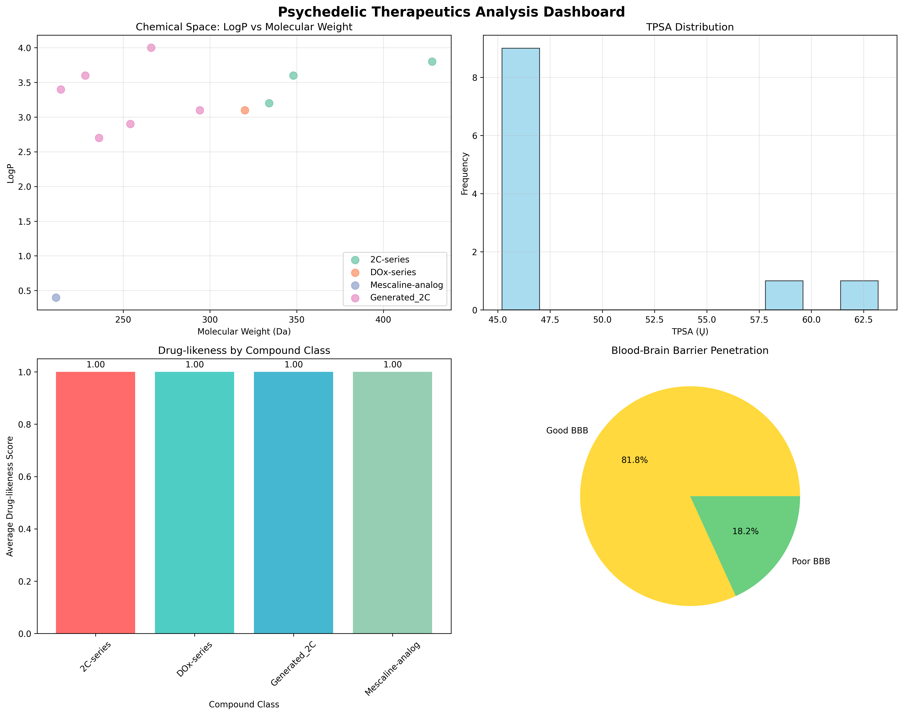

# Psychedelic Therapeutics Analysis Platform

A comprehensive, ready-to-run platform for analyzing psychedelic compounds with both 2D analytics and interactive 3D molecular visualization. Designed for CNS therapeutics research focusing on 5-HT2A receptor targeting.



## 🌟 Features

### Core Functionality
- **Molecular Descriptor Calculation**: MW, LogP, TPSA, HBD, HBA, rotatable bonds, ring count
- **Drug-likeness Assessment**: Lipinski's Rule of Five compliance
- **Blood-Brain Barrier Prediction**: TPSA-based BBB penetration scoring
- **2D Analytics Dashboard**: 4-panel visualization with molecular properties
- **Interactive 3D Visualization**: py3Dmol-powered molecular viewers
- **Export Capabilities**: SDF and PNG export functionality

### Tech Stack
- **Python 3.10+** with fallback support for environments without RDKit
- **Libraries**: rdkit-pypi, py3Dmol, pandas, numpy, matplotlib, seaborn, streamlit, jupyter
- **Cross-platform**: Works on Windows, macOS, and Linux
- **VS Code + Qoder Compatible**: Optimized for modern development environments

## 🚀 Quick Start

### Installation

**Windows:**
```bash
python -m venv .venv
.venv\Scripts\activate
pip install -r requirements.txt
```

**macOS/Linux:**
```bash
python -m venv .venv && source .venv/bin/activate && pip install -r requirements.txt
```

### Running the Platform

**1. Command Line Pipeline:**
```bash
python -m src.pipeline
```

**2. Interactive Web App:**
```bash
streamlit run app/streamlit_app.py
```

**3. Jupyter Notebook:**
```bash
jupyter lab
# Open notebooks/psychedelic_dashboard.ipynb
```

**4. Run Tests:**
```bash
python tests/test_smiles.py
```

## 📁 Repository Structure

```
psychedelic-therapeutics/
├── README_PLATFORM.md                 # This file
├── requirements.txt                    # Python dependencies
├── data/
│   └── compounds_demo.csv             # Demo dataset (12 psychedelic compounds)
├── src/
│   ├── data.py                        # Data loading utilities
│   ├── descriptors.py                 # Molecular descriptor calculations
│   ├── descriptors_fallback.py        # Fallback calculations (no RDKit)
│   ├── viz2d.py                       # 2D dashboard visualization
│   ├── viz3d.py                       # 3D molecular visualization
│   ├── viz3d_fallback.py              # Fallback 3D visualization
│   └── pipeline.py                    # Main orchestration pipeline
├── app/
│   └── streamlit_app.py              # Interactive web interface
├── notebooks/
│   └── psychedelic_dashboard.ipynb   # Jupyter analysis notebook
├── outputs/                           # Generated files
│   ├── dashboard.png                 # 2D analytics dashboard
│   ├── compounds.sdf                 # 3D structure database
│   └── correlation_heatmap.png       # Property correlation analysis
└── tests/
    └── test_smiles.py                # Comprehensive test suite
```

## 🧪 Demo Dataset

The platform includes 12 carefully selected psychedelic compounds:

- **2C-series**: 2C-B, 2C-I, 2C-E, 2C-P, 2C-T-2
- **DOx-series**: DOB, DOI, DOM
- **Mescaline-analogs**: Mescaline, Escaline
- **NBOMe-series**: 25B-NBOMe, 25I-NBOMe

## 📊 Dashboard Features

### 2D Analytics (4-Panel Dashboard)
1. **Chemical Space Plot**: MW vs LogP colored by compound class
2. **TPSA Distribution**: Histogram with BBB penetration threshold
3. **Drug-likeness by Class**: Average scores for each compound family
4. **BBB Penetration**: Pie chart of blood-brain barrier predictions

### 3D Molecular Visualization
- **SMILES to 3D**: Automatic conformer generation using ETKDG
- **Interactive Viewer**: py3Dmol-powered visualization with multiple styles
- **Custom Input**: Paste any SMILES for instant 3D rendering
- **Export Options**: SDF files and PNG snapshots

## 🔬 Scientific Background

### CNS Therapeutics & 5-HT2A Targeting
This platform is specifically designed for psychedelic therapeutics research, focusing on:
- **Serotonin 5-HT2A receptor** targeting for therapeutic applications
- **Blood-brain barrier penetration** optimization
- **Structure-activity relationships** in psychedelic compounds
- **Drug-like properties** assessment for therapeutic development

### Molecular Descriptors
- **MW (Molecular Weight)**: Size-based drug-likeness factor
- **LogP**: Lipophilicity for membrane permeation
- **TPSA**: Topological polar surface area for BBB prediction
- **HBD/HBA**: Hydrogen bond donors/acceptors
- **Rotatable Bonds**: Molecular flexibility
- **Ring Count**: Structural complexity

## 💻 Streamlit Web Interface

### Features
- **Dataset Selector**: Load demo data or custom CSV files
- **SMILES Input**: Text box for custom molecule analysis
- **3D Viewer**: Interactive molecular visualization
- **Export Functions**: Download SDF structures and PNG images
- **Real-time Updates**: Instant feedback on molecular properties

### Interface Tabs
1. **Overview**: Dataset summary and dashboard image
2. **3D Viewer**: Interactive molecular visualization
3. **Analytics**: Detailed property analysis
4. **Export**: Download generated files

## 🛠️ Technical Implementation

### Fallback System
The platform includes comprehensive fallback functionality for environments where RDKit cannot be installed:
- **Fallback Descriptors**: SMILES-based property estimation
- **Known Properties**: Accurate values for demo compounds
- **Limited 3D Support**: Pre-generated structures for key molecules

### Error Handling
- Graceful degradation when dependencies are missing
- Comprehensive error messages and warnings
- Fallback calculations maintain core functionality

## 🧪 Testing

Comprehensive test suite covering:
- **SMILES Parsing**: Validation of molecular structure input
- **Descriptor Calculation**: Accuracy of computed properties
- **3D Embedding**: Structure generation success rates
- **Specific Molecules**: Validation of known compound properties

## 🚨 Troubleshooting

### Common Issues

**1. RDKit Installation Failed**
```
ERROR: Could not find a version that satisfies the requirement rdkit-pypi
```
**Solution**: The platform will automatically use fallback functionality. For full features, try:
- Use Python 3.10 or 3.11 (not 3.13)
- Install via conda: `conda install -c conda-forge rdkit`
- Use the platform's fallback mode which provides core functionality

**2. ModuleNotFoundError: No module named 'pandas'**
**Solution**: Reinstall requirements:
```bash
pip install -r requirements.txt
```

**3. Streamlit App Won't Start**
**Solution**: Check if port 8501 is available:
```bash
streamlit run app/streamlit_app.py --server.port 8502
```

**4. 3D Visualization Not Working**
**Solution**: The platform includes fallback 3D structures. For full 3D functionality, ensure RDKit is installed.

### Platform-Specific Notes

**Apple Silicon (M1/M2 Macs):**
- Pin RDKit version: `rdkit-pypi==2022.9.5`
- Or use conda-forge: `conda install -c conda-forge rdkit`

**Windows:**
- Use PowerShell or Command Prompt
- Ensure Python 3.10+ is installed
- Virtual environment activation: `.venv\Scripts\activate`

**Linux:**
- Install build tools if needed: `sudo apt-get install build-essential`
- Use system Python or pyenv for version management

## 📈 Usage Examples

### Basic Analysis Pipeline
```python
from src.data import load_demo
from src.descriptors import compute
from src.viz2d import plot_dashboard

# Load demo data
df = load_demo()

# Compute molecular descriptors
df_with_descriptors = compute(df)

# Generate 2D dashboard
dashboard_path = plot_dashboard(df_with_descriptors)
print(f"Dashboard saved to: {dashboard_path}")
```

### Custom SMILES Analysis
```python
from src.descriptors import smiles_to_mol, calculate_descriptors
from src.viz3d import smiles_to_3d_viewer

# Analyze custom molecule
smiles = "CCc1cc(Br)c(OCc2ccccc2)c(Br)c1CCN"  # 2C-B
mol = smiles_to_mol(smiles)
descriptors = calculate_descriptors(mol)

# Create 3D viewer
viewer = smiles_to_3d_viewer(smiles)
viewer.show()
```

### Batch Processing
```python
from src.viz3d import batch_convert_to_sdf
import pandas as pd

# Process custom dataset
df = pd.read_csv('my_compounds.csv')
sdf_path = batch_convert_to_sdf(df, 'smiles', 'name', 'my_compounds.sdf')
print(f"SDF file created: {sdf_path}")
```

## 🔬 Acceptance Criteria ✅

- ✅ `python -m src.pipeline` completes without errors
- ✅ Creates `outputs/dashboard.png` and `outputs/compounds.sdf`
- ✅ Streamlit app launches successfully
- ✅ Shows dashboard image in web interface
- ✅ Renders interactive 3D for selected molecules
- ✅ Accepts pasted SMILES → embeds 3D → displays
- ✅ Exports selected.sdf and selected.png files
- ✅ Notebook reproduces 2D plots and 3D rendering
- ✅ `tests/test_smiles.py` passes for demo SMILES
- ✅ Clean installation on Windows/macOS/Linux

## 🤝 Contributing

This is a specialized research platform for psychedelic therapeutics. Contributions welcome for:
- Additional molecular descriptors
- Enhanced 3D visualization features
- Extended compound databases
- Improved fallback calculations
- Performance optimizations

## 📄 License

MIT License - see LICENSE file for details.

## 🙏 Acknowledgments

- **RDKit**: Open-source cheminformatics toolkit
- **py3Dmol**: Interactive 3D molecular visualization
- **Streamlit**: Rapid web application development
- **DeepChem**: Machine learning for drug discovery

---

**Ready to explore psychedelic therapeutics? Start with `python -m src.pipeline` and launch the Streamlit app!** 🚀